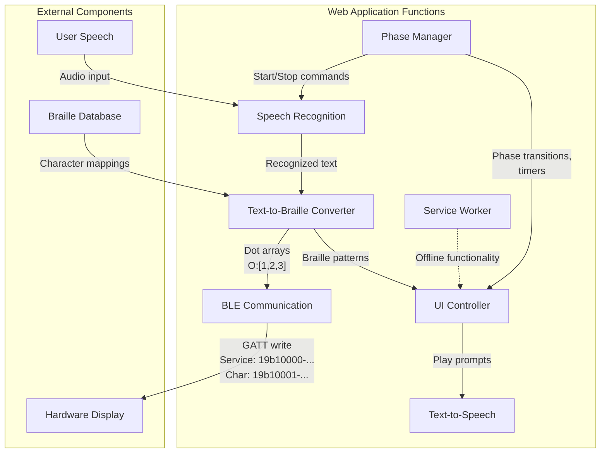
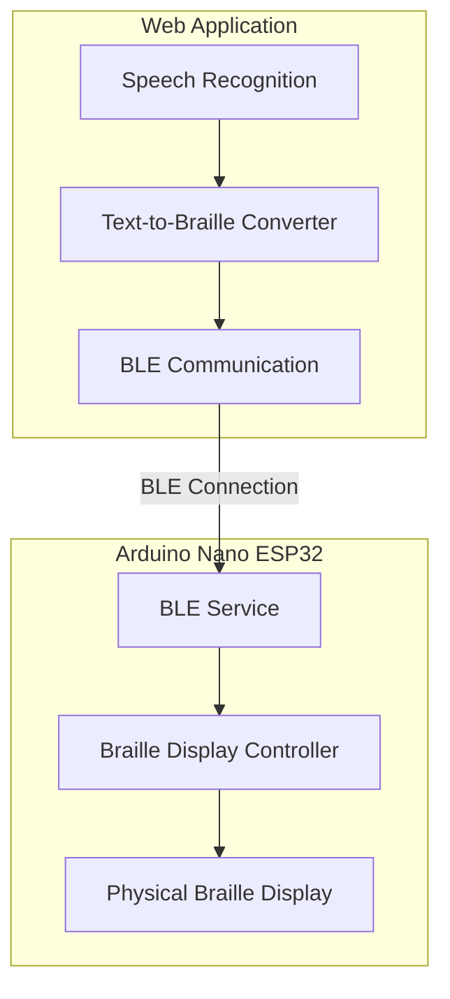

## *Created by kiloJoules³*

Apolonio, *Model Design Lead*

Ignacio, *Research Lead*

Manguni, *Software Lead*

Mission, *Hardware Lead*

> ### "Kahit 2.00 lang po, liligaya na po kami." - kJ³ Team

# Speech-to-Braille Refreshable Display - Mobile Web App

   - **Introduction Phase** (12 seconds):
     - Application starts with a welcome message
     - Text-to-speech introduces the application
     - Automatically transitions to Recording phase

   - **Recording Phase**:
     - Speech recognition is activated
     - User speaks words or phrases
     - Visual countdown timer displays remaining time
     - Audio cue signals the recording mode
     - Recognized speech is displayed in real-time

   - **Output Phase** (8 seconds):
     - Speech recognition is paused
     - Recognized text is processed for braille matches
     - Matching words with braille representations are displayed
     - Text-to-speech reads the matched word
     - Visual countdown timer displays remaining time
     - Audio cue signals the output mode

## Implementation Details

This progressive web app (PWA) converts speech to braille patterns and communicates with a hardware braille display via Bluetooth Low Energy (BLE).

### Features

- Speech recognition using Web Speech API
- Braille pattern visualization
- BLE connectivity to hardware braille display
- Offline functionality with service worker
### Application Flow DiagramPWA on Android devices

ty
- PWA features (manifest, service worker)
- Responsive design for mobile devices

### Setup Instructions

1. Ensure you have the braille database file (`braille-database.csv`) in the root directory
2. Create an `images` folder with icon images (192x192 and 512x512)
3. Host the application on a secure server (HTTPS) for full functionality
4. Access the app using Google Chrome on Android for BLE support

### BLE Communication

The app communicates with an ESP32-based braille display using the following BLE characteristics:
- Service UUID: `19b10000-e8f2-537e-4f6c-d104768a1214`
- Characteristic UUID: `19b10001-e8f2-537e-4f6c-d104768a1214`

Data is sent in the format: `O:[1,2,3]` or `O:[[1,2],[3,4]]` where:
- `O:` indicates output phase
- The array represents braille dot patterns
## System Architecture

